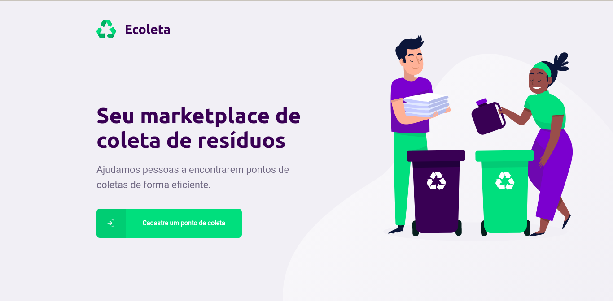
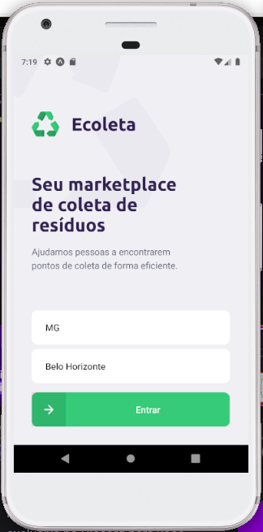

# nlw-01-ecoleta


<h1 align="center">
  
</h1>

<p align="center">
  

  
  
  <a href="https://github.com/LucasPereiraMiranda/nlw-01-ecoleta/commits/master">
    
  </a>

  <a href="https://github.com/LucasPereiraMiranda/nlw-01-ecoleta/issues">
    
  </a>
</p>

<p align="center">
  <a href="#-techs">Techs</a>&nbsp;&nbsp;&nbsp;|&nbsp;&nbsp;&nbsp;
  <a href="#-project">Project</a>&nbsp;&nbsp;&nbsp;|&nbsp;&nbsp;&nbsp;
  <a href="#-frontend">Frontend</a>&nbsp;&nbsp;&nbsp;|&nbsp;&nbsp;&nbsp;
  <a href="#-mobile">Mobile</a>&nbsp;&nbsp;&nbsp;|&nbsp;&nbsp;&nbsp;
  <a href="#-installation">Installation</a>&nbsp;&nbsp;&nbsp;|&nbsp;&nbsp;&nbsp;
  <a href="#-obs">Obs</a>&nbsp;&nbsp;&nbsp;|&nbsp;&nbsp;&nbsp;
</p>

<br>


---

## 🚀 Techs

Ecoleta app was developed with these technologies

- [TypeScript](https://github.com/Microsoft/TypeScript)
- [Express](https://github.com/expressjs/express)
- [Node.js](https://nodejs.org/en/)
- [React](https://reactjs.org)
- [React Native](https://facebook.github.io/react-native/)
- [Expo](https://expo.io/)
- [Celebrate](https://github.com/arb/celebrate)
- [Image Upload](react-dropzone)
- [IBGE Rest API](https://servicodados.ibge.gov.br/api/docs/localidades?versao=1#api-UFs-estadosGet)
- [React-Leaflet](https://github.com/PaulLeCam/react-leaflet)
- [Multer](https://www.npmjs.com/package/multer)
- [Knex](http://knexjs.org/)
- [SQLite3](https://www.sqlite.org/index.html)
 

## 💻 Project

This project was developed in next level week #1, organized by Rocketseat 🚀 with the aim of helping organizations to find collection points for the disposal of organic and inorganic waste, thus contributing to the sustainability and well-being of the environment. ESlint, Prettier and Editor Config were added. 
The package manager used in this version of the project was the Yarn.


## 🌐 Frontend
<h1 align="center">
    
</h1>

## 📱 Mobile
<h1 align="center">
    
</h1>

## :boom: Installation

```bash
# Clone this repo
$ git clone git@github.com:LucasPereiraMiranda/nlw-01-ecoleta.git

# Inside all dirs, build dependencies with:
$ yarn

# Inside server, run database commands with:
$ yarn knex:migrate
$ yarn knex:seed

# Inside web dir, run the web app
$ yarn start

# Inside mobile dir, run the mobile app in your simulator device or smartphone
$ expo start

```
## :warning: Obs
Change the baseURL in api.ts file of the web and mobile folders to your computer ip (see more in expo localhost on browser)

---

Developed on Next Level Week #1 from [RocketSeat](https://rocketseat.com.br) :rocket:.